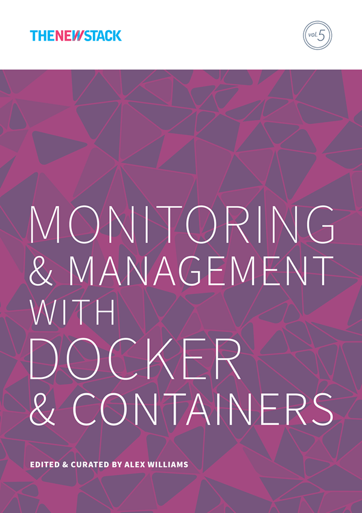
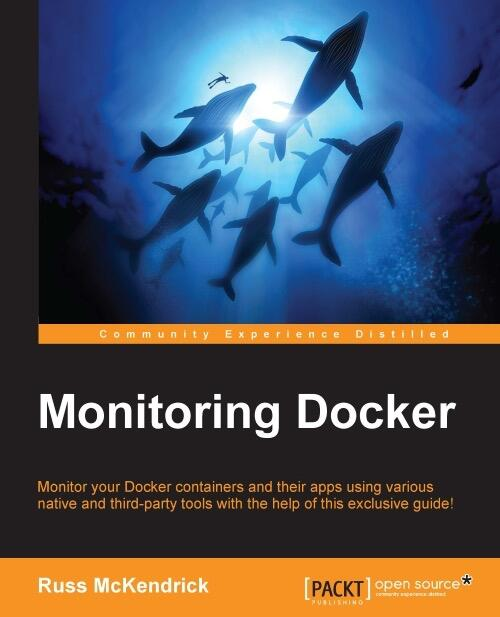

Hi there 👋, I am an experienced dev-ops practitioner and system administrator with a passion for automation and containers. I have been working in IT and related industries for the better part of 25 years. During my career, I have had varied responsibilities in many different sectors, ranging from looking after an entire IT infrastructure to providing first-line, second-line, and senior support in both client-facing and internal teams for small and large organisations.

I work almost exclusively with Linux, using open source systems and tools across both dedicated hardware and virtual machines hosted in public and private clouds at N4Stack which is a Node4 company, where I am a Practice Manager (SRE & DevOps).

 

In my spare time, I have written seven books "Monitoring Docker", "Extending Docker", "Docker Bootcamp", "Mastering Docker - Second Edition", "Kubernetes for Serverless Applications" and Learn Ansible which are all available now from Packt Publishing. I have also contributed to "Monitoring and Management With Docker and Containers", which was published by The New Stack. My seventh book, "Mastering Docker - Third Edition", has just been published by Packt Publishing.
I also buy way too many records.

                    

  